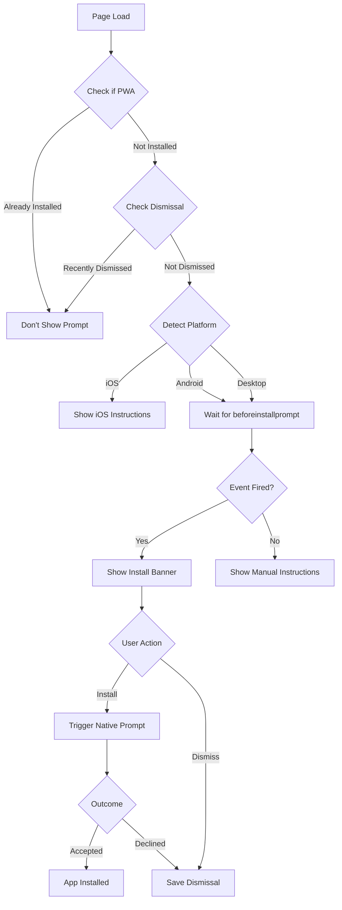

# PWA Installation Implementation Guide

## Overview
This document outlines the complete Progressive Web App (PWA) installation implementation for NyambikaAI. The implementation provides a seamless installation experience across all platforms (iOS, Android, and Desktop) with smart detection and platform-specific instructions.

## Architecture

### 1. Core Components

#### **InstallPrompt Component** (`/src/components/InstallPrompt.tsx`)
- **Purpose**: Smart installation prompt with device/platform detection
- **Key Features**:
  - Automatic platform detection (iOS, Android, Desktop)
  - Native browser install prompt integration
  - Platform-specific manual instructions
  - Session-based dismissal (7 days default)
  - Loading states and error handling
  - Analytics tracking (Google Analytics integration)
  - Dark/light theme support
  - Accessibility compliant (ARIA labels, keyboard navigation)

#### **Manifest File** (`/public/manifest.json`)
- **Purpose**: PWA metadata and configuration
- **Specifications**:
  - Icons: 192x192 and 512x512 (both regular and maskable)
  - Display mode: standalone
  - Orientation: portrait-primary
  - Theme colors: Light (#6366f1) and Dark (#3730a3)
  - App shortcuts: Try-On, Stores, Profile
  - Share target support for images

#### **PWA Configuration** (`/next.config.js`)
- **Purpose**: Service worker generation and caching strategy
- **Features**:
  - next-pwa plugin integration
  - Runtime caching for external images (Unsplash, Pexels, Cloudinary)
  - Automatic service worker registration
  - skipWaiting enabled for instant updates

### 2. Installation Flow



## Platform-Specific Behavior

### iOS (Safari)
- **Detection**: User agent + platform check
- **Behavior**: 
  - No native `beforeinstallprompt` event
  - Manual instructions shown after 5s delay
  - Safari-specific Share button instructions
- **Instructions**:
  1. Tap Share button (bottom bar)
  2. Scroll down and tap "Add to Home Screen"
  3. Tap "Add" in top right corner

### Android (Chrome/Samsung Internet)
- **Detection**: User agent check
- **Behavior**:
  - Waits for `beforeinstallprompt` event
  - Shows native install prompt when available
  - Fallback to manual instructions if event doesn't fire
- **Instructions**:
  1. Tap three-dot menu (top right)
  2. Tap "Add to Home screen" or "Install app"
  3. Tap "Install" to confirm

### Desktop (Chrome/Edge)
- **Detection**: Process of elimination (not iOS, not Android)
- **Behavior**:
  - Waits for `beforeinstallprompt` event
  - Shows banner in bottom-left corner
  - Native install prompt on click
- **Instructions**:
  1. Look for install icon in address bar
  2. Click and select "Install"
  3. App added to desktop/dock

## UI/UX Design

### Install Banner
- **Position**: Bottom-left on desktop, full-width on mobile
- **Design Features**:
  - Gradient overlay with glassmorphism effect
  - Platform-specific icon (Smartphone/Monitor)
  - Clear call-to-action buttons
  - Dismissible with X button
  - Smooth slide-in animation
  - Responsive layout

### Installation Modal
- **Trigger**: When native prompt unavailable or on "How to Install" click
- **Design Features**:
  - Gradient header with app branding
  - Benefits section (why install)
  - Step-by-step instructions with numbered badges
  - Platform-specific visual icons
  - iOS Safari compatibility note
  - Backdrop blur overlay
  - Zoom-in animation

### Theme Integration
- Supports both light and dark themes
- Uses CSS custom properties from global theme
- Gradient colors adapt to theme
- Maintains contrast ratios for accessibility

## Session Management

### Dismissal Logic
```typescript
// Dismissal is stored in localStorage
localStorage.setItem('pwa-prompt-dismissed', Date.now().toString());

// Check if dismissed within last 7 days (configurable)
const daysSinceDismissal = Math.floor(
  (Date.now() - dismissedDate) / (1000 * 60 * 60 * 24)
);

if (daysSinceDismissal < showAfterDismissalDays) {
  // Don't show prompt
}
```

### Props Configuration
```typescript
<InstallPrompt 
  delay={5000}                    // 5s delay before showing (default)
  showAfterDismissalDays={7}      // Show again after 7 days (default)
/>
```

## Analytics Integration

### Tracked Events
1. **pwa_installed**: When app is successfully installed
2. **pwa_install_choice**: User's response to native prompt (accepted/dismissed)
3. **pwa_install_dismissed**: When user dismisses the banner
4. **pwa_install_error**: When installation fails

### Event Structure
```javascript
gtag('event', 'pwa_installed', {
  event_category: 'PWA',
  event_label: 'ios' | 'android' | 'desktop'
});
```

## Service Worker

### Caching Strategy
- **Strategy**: CacheFirst for external images
- **Cached Resources**:
  - Unsplash images (30 days, max 100 entries)
  - Pexels images (30 days, max 100 entries)
  - Cloudinary images (30 days, max 100 entries)

### Automatic Registration
```javascript
// Handled by next-pwa
{
  register: true,
  skipWaiting: true,
  dest: 'public'
}
```

## Debugging

### Development Console Logs
When `NODE_ENV === 'development'`:
```
🔍 PWA Install Prompt Debug:
  - HTTPS: true/false
  - Service Worker: true/false
  - Manifest: true/false
  - Platform: ios/android/desktop
  - Standalone: true/false
  - SW Registered: Yes/No
```

### Common Issues & Solutions

#### Issue: beforeinstallprompt not firing
**Causes**:
- Not using HTTPS (localhost is exempt)
- Manifest errors or missing
- Service worker not registered
- Icons missing or wrong size
- Already installed

**Debug**:
```javascript
// Check manifest
fetch('/manifest.json').then(r => r.json()).then(console.log)

// Check service worker
navigator.serviceWorker.getRegistrations().then(console.log)

// Check if standalone
window.matchMedia('(display-mode: standalone)').matches
```

#### Issue: Icons not displaying
**Solution**:
- Ensure icons are in `/public` directory
- Icons must be at least 192x192 and 512x512
- Use PNG format with proper MIME type
- Include both 'any' and 'maskable' purposes

#### Issue: Prompt shows every time
**Solution**:
- Check localStorage for 'pwa-prompt-dismissed'
- Verify dismissal logic in component
- Clear browser cache and localStorage

## Testing Checklist

### Pre-deployment
- [ ] HTTPS enabled (or localhost for dev)
- [ ] Service worker registers successfully
- [ ] Manifest is valid and accessible
- [ ] Icons exist and are correct sizes
- [ ] All routes defined in manifest exist
- [ ] Theme colors match design system

### iOS Testing
- [ ] Opens in Safari
- [ ] Manual instructions display
- [ ] Share button instructions visible
- [ ] Can add to home screen
- [ ] Launches in standalone mode
- [ ] Icon displays on home screen

### Android Testing  
- [ ] beforeinstallprompt fires
- [ ] Native prompt displays
- [ ] Install completes successfully
- [ ] App icon appears in app drawer
- [ ] Launches in standalone mode

### Desktop Testing
- [ ] beforeinstallprompt fires in Chrome/Edge
- [ ] Install banner displays
- [ ] Native prompt works
- [ ] App installs to desktop
- [ ] App launches from desktop

### Accessibility
- [ ] Keyboard navigation works
- [ ] Screen reader announces elements
- [ ] ARIA labels present
- [ ] Focus indicators visible
- [ ] Color contrast meets WCAG AA

## Maintenance

### Updating the Manifest
1. Edit `/public/manifest.json`
2. Update cache-busting query in `/src/app/layout.tsx`:
   ```typescript
   manifest: `/manifest.json?v=${Date.now()}`
   ```
3. Test across all platforms

### Updating Install Prompt
1. Modify `/src/components/InstallPrompt.tsx`
2. Test on multiple devices
3. Verify analytics events still fire
4. Check theme compatibility

### Icon Updates
1. Create new icons at required sizes (192x192, 512x512)
2. Place in `/public` directory
3. Update manifest.json references
4. Clear service worker cache
5. Test installation on all platforms

## Best Practices

### Do's ✅
- Show prompt after user engagement (5s delay minimum)
- Provide clear benefits of installation
- Respect user's dismissal choice
- Support all major platforms
- Include fallback instructions
- Track installation metrics
- Test on real devices

### Don'ts ❌
- Show prompt immediately on page load
- Show prompt on every page visit
- Ignore dismissal preferences
- Use non-standard icon sizes
- Skip accessibility features
- Forget to test offline functionality
- Assume beforeinstallprompt will fire

## Browser Support

| Browser | Install Support | Notes |
|---------|----------------|-------|
| Chrome (Desktop) | ✅ Full | beforeinstallprompt |
| Chrome (Android) | ✅ Full | beforeinstallprompt |
| Edge (Desktop) | ✅ Full | beforeinstallprompt |
| Safari (iOS) | ⚠️ Manual | Add to Home Screen only |
| Safari (macOS) | ❌ No | Not supported |
| Firefox | ❌ No | No PWA install support |
| Samsung Internet | ✅ Full | beforeinstallprompt |

## Performance Impact

### Bundle Size
- InstallPrompt component: ~15KB (minified + gzipped)
- Lucide icons: ~3KB per icon
- Total addition: ~25KB

### Runtime Performance
- Platform detection: <1ms
- Event listener setup: <1ms
- Banner render: ~16ms (1 frame)
- Modal render: ~32ms (2 frames)

### Network Impact
- Manifest: ~1KB (cached)
- Icons: ~50KB total (cached)
- Service worker: ~5KB (cached)

## Future Enhancements

### Potential Improvements
1. **A/B Testing**: Test different prompt designs and timing
2. **Personalization**: Show different benefits based on user behavior
3. **Multi-language**: Support for multiple languages
4. **Animations**: More sophisticated entry/exit animations
5. **Push Notifications**: Add push notification permissions request
6. **Update Prompt**: Notify users when new version is available
7. **Install Metrics Dashboard**: Visualize installation conversion rates

### Planned Features
- [ ] Progressive disclosure of benefits
- [ ] Install completion celebration animation
- [ ] Pre-install checklist for developers
- [ ] Automated icon generation from SVG
- [ ] Install prompt A/B testing framework

## Resources

### Documentation
- [MDN PWA Guide](https://developer.mozilla.org/en-US/docs/Web/Progressive_web_apps)
- [web.dev PWA](https://web.dev/progressive-web-apps/)
- [Next-PWA Docs](https://github.com/shadowwalker/next-pwa)

### Tools
- [Lighthouse](https://developers.google.com/web/tools/lighthouse) - PWA audit
- [PWA Builder](https://www.pwabuilder.com/) - Validation
- [Manifest Generator](https://app-manifest.firebaseapp.com/)

### Testing
- [Chrome DevTools Application Tab](https://developer.chrome.com/docs/devtools/)
- [iOS Simulator](https://developer.apple.com/xcode/)
- [Android Studio Emulator](https://developer.android.com/studio)

---

**Last Updated**: October 2025  
**Maintained by**: Nyambika Team  
**Version**: 1.0.0
